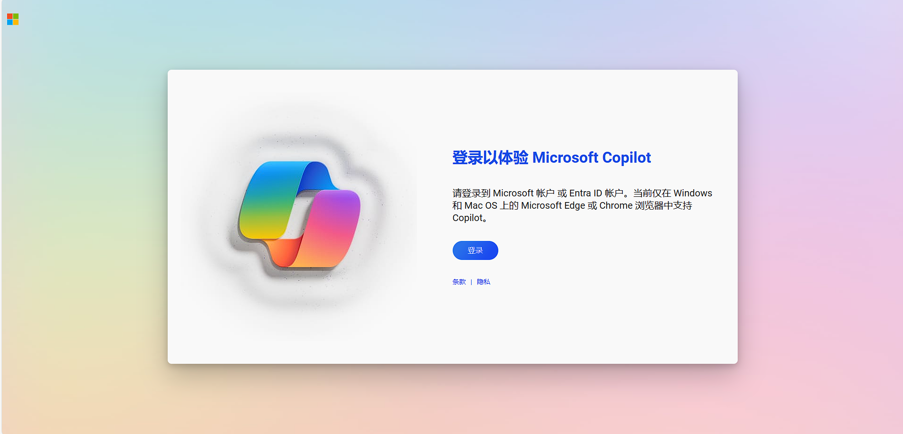
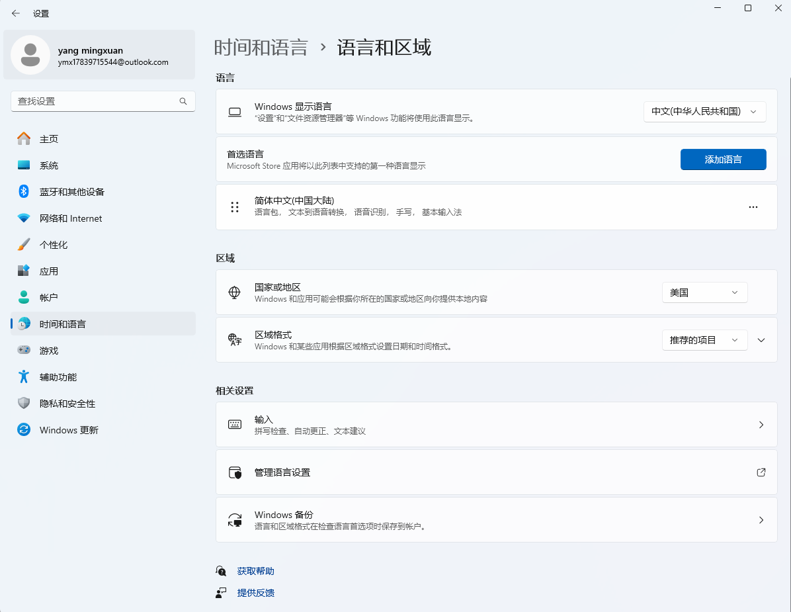
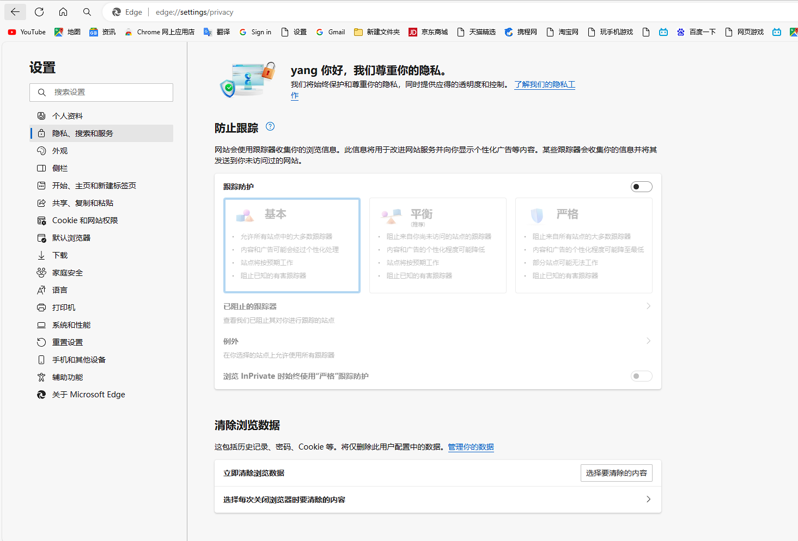

## 简介



Copilot 是微软的人工智能，已经用上了阉割版的 GPT 4，有多个不同的版本。
1. Github Copilot：AI 工具，一般用于代码生成。
2. Microsoft Copilot：在 Windows、Edge、Office 以及 Bing 中进行使用。

## Github Copilot


一般来说有两个月的试用，建议偶尔向一些开源项目提一下 pr 。

之后可以在 VS Code 中安装对应的 Github Copilot 插件来进行使用。

## Microsoft Copilot

相比较而言这款就比较难一点了，首先需要使用 win 11 的最新系统。我的笔记本电脑不使用 Windows Insider 也可以正常使用，实测可能看脸。

### 设置区域



需要将区域改为美国。

无需更改中文，只需要改区域就可以了，之后使用 VPN 选择日本或者韩国都可以。

### 账号

实测如果是长期使用国内的微软账号号会黑，因此建议创建一个新的微软账号重新进行使用，或者直接使用谷歌账号就可以了。

### 强制使用 Copilot

一般更新到最新系统之后会自动推送 Copilot ，如果没有的话需要进行以下步骤。

安装 [ViVe tool](https://github.com/thebookisclosed/ViVe/releases)。将压缩包解压。

以管理员方式打开命令提示符，进入解压后的文件夹。

```sh
cd C:\Users\ymx17\Downloads\ViVeTool-v0.3.3
vivetool /enable /id:44774629,44776738,44850061,42105254,41655236
```

执行后重启即可。

### 多账号登录

如果长时间出现登录无效，浏览器地址栏输入 `edge://settings/privacy`。



