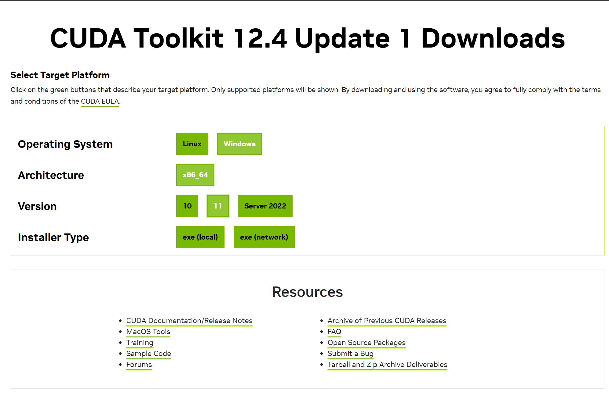
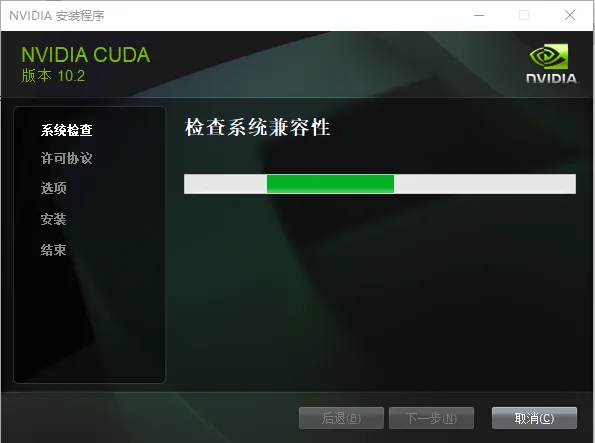
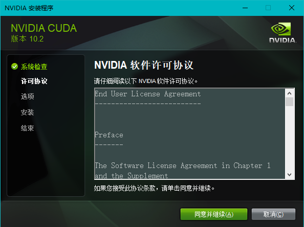
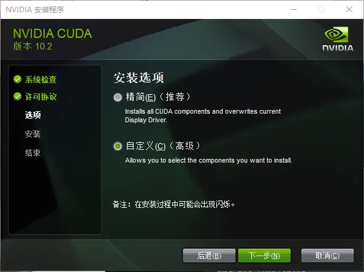
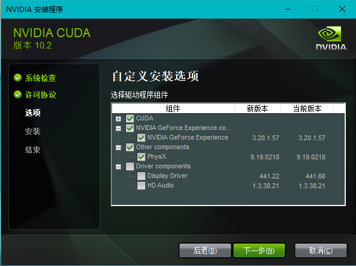
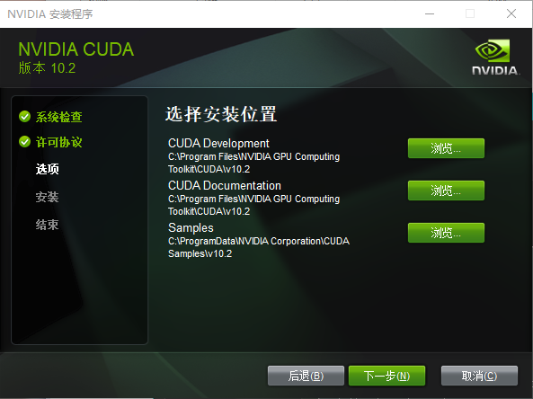

## 简介

统一计算设备架构（Compute Unified Device Architecture, CUDA），是由NVIDIA推出的通用并行计算架构。解决的是用更加廉价的设备资源，实现更高效的并行计算。

你可以简单理解为并行计算提高运行效率，因此 NVIDIA 的 GPU 能引领 AI 时代，但是现在的大部分云厂商和厂商都开始去 CUDA 化。

## 安装

### Windows 的安装

应该保证安装 Microsoft Visual Studio 的 gcc 编译器，Windows 编译器如下表所示。

|编译器| IDE|C++ Dialect|
|---|---|----|
|MSVC Version 193x|Visual Studio 2022 17.x|C++14 (default), C++17, C++20|
|MSVC Version 192x|Visual Studio 2019 16.x|C++14 (default), C++17|
|MSVC Version 191x|Visual Studio 2017 15.x (RTW and all updates)|C++14 (default), C++17, C++20|

你需要保证你的显卡是 NVIDIA 的显卡并升级到最新的驱动，之后在来到 NVIDIA 的官网下载 CUDA 的安装包，选择自己需要的版本。



:::tip 本地和 network 的选择
更推荐 local 版本，因为在后续的安装过程中不会出现因为网络问题造成安装失败。
:::

很多国内的介绍都说需要查看 NVIDIA 的控制面板来确定版本，但是实际上在官方的要求中，你只需要查看你的 GPU 是否支持即可。


打开 exe 文件之后选择需要安装的位置。


等待打开安装界面，等待初始化完成。



同意许可协议。



选择需要的安装模式，如果你选择自定义模式，则可以选择自己希望安装的组件。



如果选择自定义，则选择需要的组件。



选择组件安装位置。



等待安装完成即可。


关闭 CUDA 安装程序，你可选择自己需要的选项。


你可以在命令行中使用 `nvcc -V` 来验证是否安装成功，如果提示 `nvcc 不是内部或外部命令，也不是可运行的程序或批处理文件`，需要设置环境变量，如果你并不懂这里，可以选择重新安装。 

### WSL 的安装

先决条件是你安装了 Docker。

```sh
# 为 NVIDIA 容器工具包设置稳定存储库
distribution=$(. /etc/os-release;echo $ID$VERSION_ID)

curl -s -L https://nvidia.github.io/nvidia-docker/gpgkey | sudo gpg --dearmor -o /usr/share/keyrings/nvidia-docker-keyring.gpg

curl -s -L https://nvidia.github.io/nvidia-docker/$distribution/nvidia-docker.list | sed 's#deb https://#deb [signed-by=/usr/share/keyrings/nvidia-docker-keyring.gpg] https://#g' | sudo tee /etc/apt/sources.list.d/nvidia-docker.list

# 安装 NVIDIA 运行时包和依赖项
sudo apt-get update
sudo apt-get install -y nvidia-docker2

# 运行机器学习框架容器示例
docker run --gpus all -it --shm-size=1g --ulimit memlock=-1 --ulimit stack=67108864 nvcr.io/nvidia/tensorflow:20.03-tf2-py3
```

### Linux 安装

以 Ubuntu 为例，首先需要安装驱动，你应该安装 C/C++ 编译器，如果没有可参考其他内容。不太推荐，因为一些比较冷门的 Linux 发行版可能出现很多的 bug。

```sh
$ sudo apt install ubuntu-drivers-common
```

安装软件包。

```sh
$ sudo apt install nvidia-driver-535
```

重新启动计算机。


安装 CUDA。

```sh
$ wget https://developer.download.nvidia.com/compute/cuda/12.4.1/local_installers/cuda_12.4.1_550.54.15_linux.run
$ sudo sh cuda_12.4.1_550.54.15_linux.run
```

设置环境变量。

```sh
echo 'export PATH=/usr/local/cuda/bin${PATH:+:${PATH}}' >> ~/.bashrc
source ~/.bashrc
```
