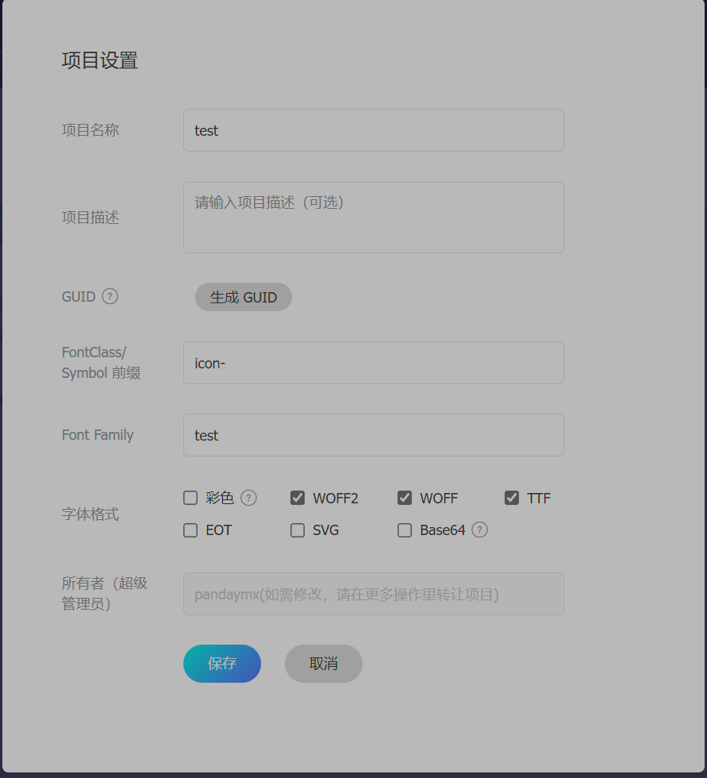
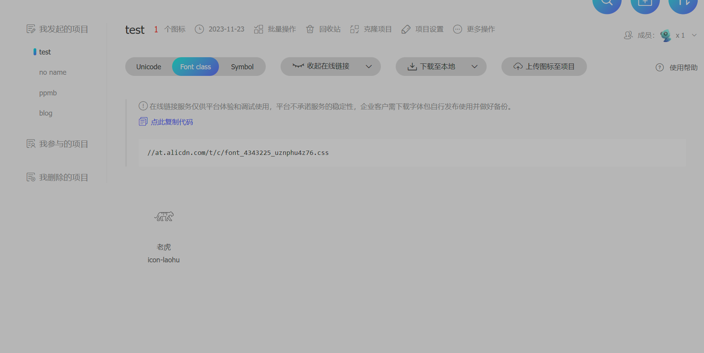

## 深色模式

`theme.darkmode` 配置深色模式，有五个可选值：

- `"switch"`：深色模式、浅色模式和自动之间切换（默认）
- `"toggle"`: 在深色模式和浅色模式之间切换
- `"auto"`: 自动根据用户设备主题或当前时间决定是否应用深色模式
- `"enable"`: 强制深色模式
- `"disable"`: 禁用深色模式

## 主题色

### 默认主题色

`.vuepress/styles/palette.scss` 中通过 `$theme-color` 设置站点的默认主题颜色。

```scss
$theme-color: #f00;
```

### 调色板主题色

`.vuepress/styles/config.scss` 中通过 `$theme-colors` 设置其他主题色。

```scss
$theme-colors: #2196f3, #f26d6d, #3eaf7c, #fb9b5f;
```

## 图标支持

图标可在页面、侧边栏和导航栏通过 `icon` 属性进行设置。

### Markdown

通过使用 `<HopeIcon` 组件在 markdown 中插入图表，`icon` 属性也可以插入 url ，`color` 属性设置图标颜色，`size` 属性设置图标大小。

- <HopeIcon icon="ppmb icon-home" color="red" />

### 阿里图标库

`iconAssets` 全局设置图标 url，推荐使用阿里的图标库，只教一种。

`iconAssets` 可存放图标资源关键字、css 和 js 格式的图标资源和它们之间的数组。

在阿里矢量图创建一个账号，找到需要的图标，点击上方的添加入库图标，将图标添加到项目。




FontClass 前缀和 Font Family 需要设置。



复制这行代码，配置 `theme.iconAssets`。


使用图标应当使用 `test icon-tiger`。

## 代码主题

### Prism.js

默认设置的，一般无需配置，可以配置 `theme.plugins.prismjk.light` 和 `theme.plugins.prismjk.night` 来更改主题，具体的主题值可参考官方文档。

### Shiki.js

1. 配置 `theme.plugins.prismjk: false` 来禁用 `@vuepress/plugin-prismjs` 插件。


2. 安装插件：
   
    ```bash
    pnpm add -D @vuepress/plugin-shiki@next
    ```
  
3. 导入插件
   
    ```ts
    import { shikiPlugin } from "@vuepress/plugin-shiki";
    import { defineUserConfig } from "vuepress";

    export default defineUserConfig({
      plugins: [
        shikiPlugin({
          // 你的选项
          theme: "one-dark-pro",
        }),
      ],
    })
    ```

4. `.vuepress/styles/config.scss` 中设置代码块背景颜色 ` $code-bg-color` 和字体颜色 `$code-color`

## 更多界面功能

1. `theme.print`：打印功能。

2. `theme.fullscreen`：全屏功能。

3. `theme.backToTop`：回到顶部功能。

     - `theme.backToTop.threshold: 500` 默认值 100，滚动阙值，以像素为单位

     - `progress: false`  默认值 true，是否显示滚动进度。

设置为 `false` 即可关闭。


`theme.prue` 用于设置纯净模式，可设置为 true 打开。

## 主题样式

将 `custom: true` 作为选项传给 `hopeTheme`。

### 安装依赖

在 `package.json` 文件中添加 `"@vuepress/utils": "2.0.0-rc.0",` 第二个参数应该和 Vuepress 版本一致。
 
### 必应壁纸和每日一词

config.ts 配置文件

```ts
import { getDirname, path } from "@vuepress/utils";
import { defineUserConfig } from "vuepress";

const __dirname = getDirname(import.meta.url);

export default defineUserConfig({
  alias: {
    "@theme-hope/modules/blog/components/BlogHero": path.resolve(
      __dirname,
      "./components/BlogHero.vue",
    ),
  },
});
```

创建 `.vuepress/components/BlogHero.vue` 文件。

```ts
<script setup lang="ts">
import BlogHero from "vuepress-theme-hope/blog/components/BlogHero.js";
import BingHeroBackground from "vuepress-theme-hope/presets/BingHeroBackground.js";
import HitokotoBlogHero from "vuepress-theme-hope/presets/HitokotoBlogHero.js";
</script>

<template>
  <BlogHero>
    <template #heroBg>
      <BingHeroBackground />
    </template>
    <template #heroInfo="heroInfo">
      <HitokotoBlogHero v-bind="heroInfo" />
    </template>
  </BlogHero>
</template>
```

### 站点时间

创建 `.vuepress/client.ts` 文件。

```ts
import { defineClientConfig } from "@vuepress/client";
import { setupRunningTimeFooter } from "vuepress-theme-hope/presets/footerRunningTime.js";
import "vuepress-theme-hope/presets/shinning-feature-panel.scss";
import "vuepress-theme-hope/presets/left-blog-info.scss";
import "vuepress-theme-hope/presets/bounce-icon.scss";

export default defineClientConfig({
  setup() {
    setupRunningTimeFooter(
      new Date("2023-11-24"),
      {
        "/": "已运行 :day 天 :hour 小时 :minute 分钟 :second 秒",
      },
      true,
    );
  },
});
```

## 无需配置

1. SEO 是搜索引擎优化，后续进行修改和自定义，默认即可。

2. SiteMap 一般无需配置，博客足够大可能需要站点地图来进行优化。

3. Feed 比较古老，无需配置。

4. PWA 渐进式 Web 应用，可以离线运行 web 网站，易于安装，后期可根据自身条件进行配置。

## 评论

### Giscus

需要准备公开仓库、安装 [Giscus APP](https://github.com/apps/giscus)。

在 [Giscus 页面](https://giscus.app/zh-CN) 需要填写仓库名称和分类，`data-repo`, `data-repo-id`, `data-category` 和 `data-category-id` 四个值需要作为 `theme.plugins.comment` 中。

```ts
import { hopeTheme } from "vuepress-theme-hope";

export default hopeTheme({
  plugins: {
    comment: {
      provider: "Giscus",
      repo: '用户名/仓库名',
      repoId: '仓库ID',
      category： '测试',
      categoryId: 'id',
    
    },
  },
});
```

### Waline

```sh
pnpm add -D @waline/client
```

需要获取 LeanCloud 的应用的 `APP ID`,`APP Key` 和 `Master Key`。

点击下方按钮进行部署。


[](https://vercel.com/new/clone?repository-url=https%3A%2F%2Fgithub.com%2Fwalinejs%2Fwaline%2Ftree%2Fmain%2Fexample)


在环境变量中配置 `LEAN_ID`, `LEAN_KEY` 和 `LEAN_MASTER_KEY`  三个环境变量。和  `APP ID`,`APP Key` 和 `Master Key` 对应。

部署完成后配置 `theme.ts` 文件：


```ts
import { hopeTheme } from "vuepress-theme-hope";

export default hopeTheme({
  plugins: {
    comment: {
      provider: "Waline",
      serverURL: "服务器地址",
    },
  },
});
```

建议配置国内域名，否则可能无法正常访问。


## 搜索框

安装 `pnpm add -D vuepress-plugin-search-pro`:

```sh
pnpm add -D vuepress-plugin-search-pro
``` 

配置：

```ts
import { defineUserConfig } from "vuepress";
import { hopeTheme } from "vuepress-theme-hope";

export default defineUserConfig({
  theme: hopeTheme({
    plugins: {
      searchPro: true,
      // searchPro: {
      //   插件选项
      // },
    },
  }),
});
```