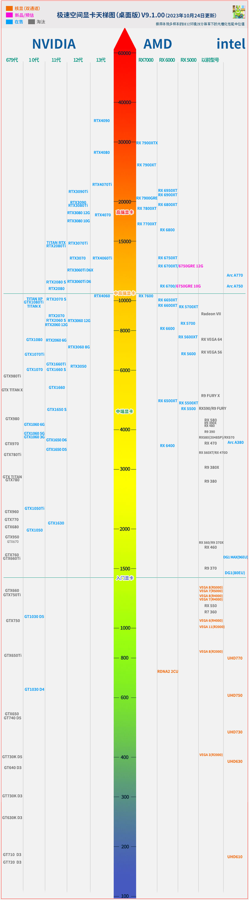
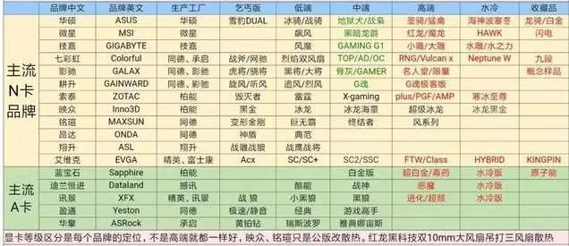

## 概述

### 台式机

台式机建议自己真正组装一下，可以真的了解很多，一方面可以锻炼自己的动手能力，未来再次也能去干装机，至少多学一门手艺。

台式机的优点很多，但是最差的就是便携性。

:::tip 是否要买整机

我的建议是不要买，如果真的要买，一定要将型号完全知道，因为一个ddr5的内存，就频率不同就能差出千把块。更何况显卡和主板这些型号更多的。

:::

### 笔记本

```pie
title 笔记本厂商占比
  "联想" : 180646
  "惠普" : 104303
  "ThinkPad" : 87852
  "华硕" : 70053
  "机械革命" : 64292
  "华为" : 60135
  "戴尔" : 58493
  "苹果" : 48850
  "宏碁" : 34859
  "ThinkBook" : 28454
```

笔记本的话我建议程序员直接买苹果笔记本，其他的话游戏本和轻薄本的话，任意选一个自己觉得好看的就行。不太建议买商务本或者轻薄本。

华为和小米不太建议大学生买，因为你大概率不可能大学四年只用电脑做学业相关的吧，华为和小米主要是做轻薄本的。

:::tip  关于苹果
苹果确实可以说是最适合程序员的，但是最大的缺点也是贵，Mac 系统确实非常棒。
:::

### 其他

平板和笔记本二合一和一体机这些呢？我不太知道是怎么评价，因为一体机基本上属于淘汰了，像二合一的，骗你买的会说平板的优点和笔记本的优点都有，但是有没有一种可能，他们的缺点也都有。

## 需求建议

### 计算机学科

对于计算机学科，并不需要非常高的配置，CPU 好一点就可以，不要说自己是搞人工智能和设计的，搞人工智能的，买 GPU 显存比较多的，但是你就算买 RTX 4090 也是无底洞，也搞不过来。

搞设计的不应当以计算机行业论，因为他们一般是单个的软件为主，如果一个单个计算机软件的使用就能算计算机行业，那文员操作 word 和 ppt 也能算计算机行业了？

如果程序语言是 Java 的话内存需要更大一点，因为 Java 非常吃内存，但是一般无论是笔记本还是电脑都是可以正常加一根或者多根的，未来根据自己需求加就可以了。

### 游戏

主要看是3A大作还是腾讯全家桶，如果是腾讯全家桶，你甚至可以只买 CPU 带核显的都可以，但是3A大作就可能在显卡上下功夫了。

如果以吃鸡为分界点的话，基本上要上 1060 级以上的显卡。

## CPU

CPU 只有两家可以进行选择，因为 CPU 很难坏，因此无所谓拼多多和还是京东购买，建议哪个便宜买哪个，CPU 的注意事项比较少，因此不再过多赘述。

::: danger 硅脂

硅脂是涂在CPU写有字的盖子上的，不是其他地方！！！

:::

### 命名规则

一般而言 AMD 和 Intel 命名规则类似。

AMD 主流以 Ryzen 为主，Intel 以酷睿为主。

以 AMD Ryzen 5 5600G 为例，AMD 表示公司。Ryzen 5 表示 CPU 等级，如今的 AMD 和 Intel 都是类似的以3、5、7、9来区分等级，其中3为最低端，9为最高端。5600G 是具体型号，5表示是第5代，AMD 如今最高为7代，Intel 为14代。600为 SKU 编号，和等级有一定关系，第二位数字不大于7大于等于5，所以它是R5，G是后缀表示有核显。

intel core i7 14700K的命名规则和 AMD 还是很像的，可以推断一下，14为14代，700表示sku码，K为后缀，i7是等级。

两者无论是什么，一般都是数字越大越强，当然是同代相比的话。

常见后缀：

| 公司  | 后缀 | 含义                   |
| ----- | ---- | ---------------------- |
| AMD   | G    | 有核显版               |
| AMD   | X    | 自动超频，相当于旗舰版 |
| AMD   | 3D   | 使用3D缓存，游戏更好   |
| intel | F    | 无核显版               |
| intel | k    | 可超频版               |
| intel | x    | 至尊旗舰               |

没有写笔记本的，可以自己查看一下。AMD 还有更强的线程撕裂者，不过不建议玩游戏的买。

### 散片

散片是一个比较重要的东西，问就是能买，但你问我推不推荐，我肯定不会推荐的，因为散片出问题没有质保，哪怕有买的我也不会推荐。

因为如果是小白，我宁可要他多花点钱也不希望一直麻烦我，如果是老手自然知道如何进行选择。

散片就是拆机流出的 CPU ，相比较于原装，没有质保，没有散热风扇，各方面都没有，但是和原装没区别，加上 CPU 不容易坏，所以价格更便宜，我只能说 CPU 不经常坏，所以可以买。

### 性能相关

CPU 需要综合考虑，不能只看测评和评价，一般而言，CPU 的性能过剩，一般的 R5 5600 之上的 CPU 就能玩大部分游戏，一般而言 CPU 不会成为你的累赘。

一般游戏建议使用单核性能比较高的CPU，其他需求选多核性能比较好的 CPU。

睿频频率，睿频就是自动超频，一般上 intel 带 K 和 X 有自动睿频功能，AMD 全系有自动超频的功能。

核心数和线程数是 CPU 一次处理数据的多少，一般是越多越好，但游戏一般是单核心或者核心数较少，不太建议唯核心数。

三级缓存：三级缓存是存储数据的，建议大一点比较好。

制程工艺：一般是7nm、5nm这样，理论上越小功耗和发热越低。

### 其他

CPU 一般是能带动显卡就可以了，一般而言，13代i5以上和5代R5以上，没有带不动显卡的问题，最多无法发挥出满载功耗，日常使用无需担心。

主板的选择，一般而言主板也对对应R3、R5、R7这种的主板，可以自主选择。

至于核显，如果不是需要直播推流的话，尽量不要买，AMD 的核显要远高于 Intel 的核显。


## 主板

主板几乎只有御三家（华硕，技嘉，微星）能保证从旗舰到低端全部有货，因此建议首选御三家。如今的主板厂商除了御三家基本上属于断代了，也不要奢求买其他厂商了，映泰、华擎、铭瑄都可以适当买一下，但是 AMD 的主板这三家几乎也只是以中端为主了。

:::tip 技嘉是否需要买

作为普通人，最大的要求是活着，如果钱对你很重要的话，买了技嘉也无所谓。

:::

### 芯片组

芯片组和 CPU 型号有类似的地方，也是分高中低三个档次。其中 Intel 以 H、B、Z三个字母表示级别，AMD 以 A、B、X表示级别，两者第一位数字都表示代数，第二位表示级别，一般是固定的，第三位一般固定为0，例如 AMD 的 X570 。第二位数字，Intel 一般以1，5，9为主，AMD 以2，5，7为主。

### 主板扩展和大小

主板插槽是非常重要的，因为大部分的主板都需要和其他设备进行连接，因此 USB 数量和 Wifi 模块都是很重要的，可以查看有没有自己不需要的。内存插槽的数量和支持的内存容量也很重要，虽然有一些

常见的主板有 ITX、M-ATX、ATX和E-ATX。依次慢慢大，建议使用 M-ATX 之上的，其中 E-ATX 尤其要注意机箱的大小，很可能装不进去。

主板尽量不要太丐，因为主板很容易坏，因此建议有一个不错的售后，其次就是主板需要注意和其他部件的兼容性，intel 的 cpu 和 AMD 的 CPU 不可以混用，设置 intel 需要一代换一个主板。一定要注意能不能插进去。


## 显卡



有些CPU也会有核心显卡，比如 AMD 的 CPU 中带 G 的，Intel 的 CPU 中不带 F 的型号。其中 AMD 的 GPU 是真的可以玩腾讯全家桶，但是 Intel 大部分只能当作亮机卡。

显卡可以丐一些，因为同型号最强的和最弱的差距不过7%。

### 显卡分类

nVidia 的卡一线品牌还是主板的三家，这三家都有 AMD 的显卡，因此可以闭眼入，只是微星的 AMD 显卡是最近才进入国内市场的。只是除了这三线还有一个七彩虹显卡。

二线品牌有映众、索泰、影驰、铭瑄等。

AMD 的卡一线品牌是讯景和蓝宝石，还有其他一些厂商。

Intel 的显卡最近还是看看吧。

### 显卡分级



显卡是等级最森严的，不像主板，你需要去找内存的兼容性需要不断进行调试，显卡的好坏基本不看厂商，只看等级。

大部分的品牌都有自己的旗舰卡和丐版，比较出名的就是铭瑄，丐帮帮主，还有影驰的名人堂等。


::: tip GPU 和显卡厂商区别

显卡芯片相当于户型，显卡厂商相当于装修者。

:::

### 核心显卡

核心显卡一般是 CPU 中内置的显卡，一般而言是需要插到主板上的 dp 口或者 HDMI 口上，这个一般用来检测显卡是否故障，当作亮机显卡就好。

如果你是直播的话，可以使用核心显卡进行推流，独立显卡用作游戏。

## 内存

### 内存分类

主流有ddr4内存和ddr5内存。

两者的区别就是ddr5更快、发热更少，频率更高。

但是实际使用两者的差距并没有想象中那么高。所以两者的取舍还是在于你的资金。

### 内存厂商

人傻钱多买金士顿，海盗船，芝奇。要性价比选英睿达，威刚，影驰等。穷逼买酷兽，金百达等。

### 内存颗粒

内存颗粒就是内存最终的，三星的颗粒最好，因此一般建议选三星，镁光的。

海力士颗粒还行，长鑫的话算是中段。

但是其他几家都有比较拉的，因此要好好研究一下。

:::tip 内存插法

建议插13或者24，就是隔一个插一个，然后插得时候尽量插24，因为按照南桥设计，这样可以更快。第一插槽就是离 CPU 最近的那个，依次数就可以了。

:::

## 硬盘

### 机械硬盘

我不建议买机械硬盘，因为大部分的人的资源都没有什么可备份的价值，因此也没有什么必要去做这么大的事。


### 固态硬盘

固态硬盘是主流，一般可以分为NVME硬盘和SSD固态硬盘。

NVME 是直接插在主板上的，大部分主板都有一到两个这样的，剩下的需要插到机械硬盘的SSD口，一定要注意自己有多少NVME的接口。

其次就是 NVME 有些主板和 CPU 不支持两个都全速，因此可能出现降速的情况，因此建议插在最上面的。

## 散热

### 水冷

水冷散热一定要保质期过期就换，不要有侥幸心理，因为大部分漏液的话保质期内会赔你。

### 风冷

更推荐风冷，因为风冷没有那么危险，不会有漏液危险，当然顶尖风冷也比不上顶尖水冷。但是同价位风冷碾压水冷。

## 电源

如今的电源以模组电源为主，全模组就是随插随用，半模组就是还有CPU供电线和显卡供电线。

电源不要丐，除非你电脑不想要了。

电源一定要选一个足够的电源，可以查看显卡的推荐电源，因为显卡是用电大户。

人傻钱多选海韵。

## 机箱

机箱的话一点要装的下，不要买来装不下，那就GG了，主要是主板、显卡、散热这三个的尺寸，剩下的基本都装的下。

## 组装

组装前可以先查看一些基本的装机视频。要记住一句话就可以了，不要大力出奇迹，装不上去就装不上去。

<Share colorful />