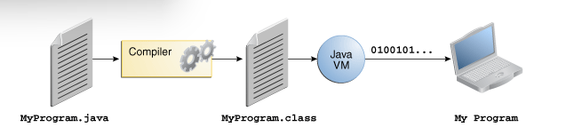
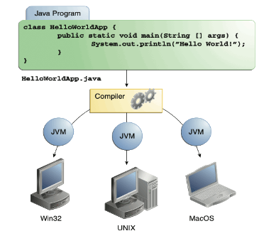

## 简介

Java是Sun公司1995年推出的编程语言和相关平台总称。2009年被Oracle收购，Java也成为Oracle公司的产品。

### Java体系

- Java SE：可以理解为Java个人版
- Java EE：可以理解为Java企业版

::: tip 
Java还有一个Java ME的微型版，但是已经被淘汰了。
:::

### 主要特性

- 简单
- 架构中立
- 面向对象
- 便携式
- 分散式
- 高性能
- 多线程
- 动态
- 安全

### 运行流程



Java源代码是以java为扩展名的纯文本文件，通过编译器进行编译之后生成class字节码文件，通过Java虚拟机来运行。



该class文件可以通过JVM在不同的计算机上运行。

### 发展历史

- 1995，Java诞生
- 1996，Jdk1.0诞生
- 1997，JDK1.1发布
- 1998，J2EE发布
- 1999，SUN公司发布Java的三个版本
- 2000，JDK1.3发布
- 2000，JDK1.4发布
- 2001，J2EE1.3发布
- 2002，J2SE1.4发布
- 2004，J2SE1.5发布，为了表示该版本的重要性，1.5更名为5.0
- 2005，J2EE 更名为Java EE，J2SE 更名为Java SE，J2ME更名为Java ME
- 2006，发布JRE1.6
- 2011，Java1.7发布
- 2014，Java8发布
- 2017，Java9发布
- 2018，Java11发布
- 2021，Java17发布
- 2023，Java21发布

## JDK

### Oracle JDK和Open JDK的区别

两者极为接近，但是存在一些差异。

- Oracle JDK提供安装程序，Open JDK提供二进制文件。
- 两者许可证不同。
- Oracle JDK是Java杯子图标，Open JDK是鸭子图标。
- Oracle JDK每六个月发布一次，Open JDK每三个月发布一次。

### JDK版本

jdk版本可以分为LTS（长期支持版本）和临时版本，其中长期支持版本有8，11，17，21。

其中11这个版本是一个过渡版本，不建议使用。

### JVM、JRE、JVM


JDK是（Java Development Kit）的缩写。包含用于Java应用程序开发的各种工具、库和Java虚拟机，以及相关的实用工具和类库。


JRE是（Java Runtime Environment）的缩写，包括基本类库和Java虚拟机，只需要运行Java程序则只安装JRE即可。


JVM是Java虚拟机（Java Virtual Machine）的缩写。它是一种虚拟的计算机，能够运行Java程序，并将Java代码转换为字节码，从而实现在不同的计算机平台上运行相同的Java程序。JVM是Java程序运行的核心组件，负责管理内存、执行字节码等功能。

### 安装

#### Windows安装

<XiGua id='7291624210080891433' autoplay/>

在[Oracle官网](https://www.oracle.com/cn/java/technologies/downloads/)中进行下载。

选择自己的版本和合适的包。


选择压缩包安装，如果选择exe和msi安装直接下一步即可。

解压之后设置环境变量：

需要添加一个JAVA_HOME的系统变量，值为Java的文件夹地址。path变量需要添加一条记录：`%JAVA_HOME\bin`。

使用命令提示符输入`java -version`查看是否可以运行。


#### Linux安装

<XiGua id='7291670589956162102'/>

这边仅仅介绍通过压缩包添加环境变量的方式来进行安装。

```shell
mkdir /usr/local/java
cd /usr/local/java
wget https://download.oracle.com/graalvm/21/latest/graalvm-jdk-21_linux-x64_bin.tar.gz
tar -xvf graalvm-jdk-21_linux-x64_bin.tar.gz
vi /etc/profile
export JAVA_HOME=/usr/local/java/graalvm-jdk-21_linux-x64_bin
export PATH=$JAVA_HOME/bin:$PATH
export CLASSPATH=.:$JAVA_HOME/lib/dt.jar:$JAVA_HOME/lib/tools.jar
source /etc/profile
```

### 安装目录

1. bin：存放各种工具命令
2. conf：相关配置文件
3. include：特定头文件
4. jmods：存放各种模块
5. legal：授权文档
6. lib：存放jar包

## HelloWorld

创建一个HelloWorld.java的文本文件，通过记事本打开，输入以下代码。

```java
public class HelloWorld{
    public static void main(String[] args) {
        System.out.println("Hello World");
    }
}
```

完成之后进行编译运行。

打开命令提示符之后运行如下命令。

```shell
javac HelloWorld.java
java HelloWorld
```

::: tip 新版本
17以后的版本可以使用java HelloWorld.java直接运行。
:::

### 最新HelloWorld文件

```java
void main(){
    System.out.println("Hello World");
}
```

通过`java --enable-preview --source 21 HelloWorld.java`来运行。

### 第一行代码
`public class 类名 {}`这一样表明是一个类，其中类名必须要和文件名相同。

### 第二行代码

`public static void main(String[] args) {}`

标准格式，其中的args可以改变，但是args表示是参数，有其特殊含义，因此不建议改变。String[]定义一个数组，可以采用C++的写法，但是不建议。

### 第三行代码

一个标准的输出语法，println表示一个换行。

<Share colorful />