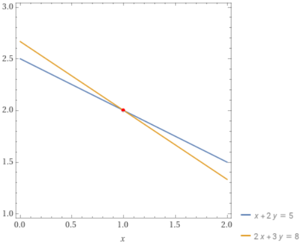

## 线性方程组

### 二元一次方程组

对于一个二元一次方程组来说，它是一个比较简单的一个线性方程组.

$$
\begin{align}
x + 2y  &= 5 \\
2x + 3y &= 8
\end{align}
$$

二元一次方程组有三种可能的情况：

1. 两直线平行，无解
2. 两直线重合，有无数解
3. 两直线相交，有唯一解

该图是上式的几何形式，很明显可以看到两者有一个交点.

### 线性方程组

形如

$$a_{1} x_{1} + a_{2} x_{2}  +\dots + a_{n} x_{n} =b$$

的方程称为线性方程，称为 n 元 1 次 方程，其中 a 包含着下标的值和 b 是实数，x 包含下标的值是变量.

含有 m 个方程组和 n 个未知量的线性方程组定义为：

$$
\begin{cases}
a_{11} x_{1} + a_{12} x_{2} + \dots + a_{1n} x_{n} = b_{1} \\
a_{21} x_{1} + a_{22} x_{2} + \dots + a_{2n} x_{n} = b_{2} \\
\dots \\
a_{m1} x_{1} + a_{m2} x_{2} + \dots + a_{mn} x_{n} = b_{m}
\end{cases}
$$

如果线性方程组无解，则称该方程组是不相容的，如果线性方程组至少存在一个解，则称为方程组是相容的.

### 线性方程组求解

如果说不考虑文中的 x 和 y 变量，可以将上文中的二元一次方程组转换为一个矩阵

$$\begin{bmatrix}1  & 2\\2  &3\end{bmatrix}$$

该矩阵称为该方程组的系数矩阵，一个 m 行 n 列的矩阵称为 m $\times$ n 矩阵，如果像该矩阵一样行数和列数相等，则称该矩阵为方针.

如果将矩阵的结果加上去，则可以组成一个新矩阵

$$
\left[
\begin{array}{cc|c}
1 & 2 & 5 \\
2 & 3 & 8
\end{array}
\right]
$$

这个矩阵称为增广矩阵，一般记作 ( A | B ).

如果要对这个矩阵进行求解，可以通过对上诉二元一次方程组的求解来进行推导

二元一次方程求解过程可以简单分为以下几步：

1. 2 式 - 2 倍的 1 式：
   $$\begin{align*}
   2x+3y-2(x+2y) &= 8 - 2\times 5 \\ -y&=-2
    \\ y&=2
    \end{align*}
   $$
2. 之后对其进行回代到 1 式或者 2 式中
   $$
   \begin{align*}
    x + 2 \times 2 &= 5\\   x &= 1
    \end{align*}
   $$

对于矩阵求解和其类似，有以下三个初等行运算，矩阵结果不变：

1. 交换两行
2. 某行乘以一个非零实数
3. 某行加上某一行的倍数

转换为矩阵运算便是以下运算：

$$
\left[
\begin{array}{cc|c}
1 & 2 & 5 \\
2 & 3 & 8
\end{array}
\right]
$$

将第一行设置为主行，其中主行的第一个非零元素称为主元.将第二行减去第一行的 2 倍，得到矩阵

$$
\left[
\begin{array}{cc|c}
1 & 2 & 5 \\
0 & -1 & -2
\end{array}
\right]
$$

这样就得到了 $-y = -2 ，y = 2$，之后通过回代法将 $y = 2$ 代入原式中即可.

### 齐次方程组

如果矩阵的每一行结果为 0，那称为齐次方程组.齐次方程组一定是有解的，只需要所有未知数都为 0 即可.因此需要求它的一个非零解.

$$
\begin{cases}
a_{11} x_{1} + a_{12} x_{2} + \dots + a_{1n} x_{n} = 0 \\
a_{21} x_{1} + a_{22} x_{2} + \dots + a_{2n} x_{n} = 0 \\
\dots \\
a_{m1} x_{1} + a_{m2} x_{2} + \dots + a_{mn} x_{n} = 0
\end{cases}
$$

## 特殊矩阵

### 行阶梯型

行阶梯型矩阵是一种特殊的矩阵，将矩阵转换成一种特殊的格式

1. 每一行的非零元素首项系数，其同列的其他元素都是0
2. 每一行的首项系数所在的列数随着行数的增大严格增大
3. 全为零的行必须在矩阵最下面

$$
\left[
\begin{array}{cccc}
1 & 2 & 3 & 4 \\
0 & 0 & 5 & 6 \\
0 & 0 & 0 & 7 \\
0 & 0 & 0 & 0
\end{array}
\right]
$$

### 行最简型矩阵

行最简型矩阵式行阶梯型的又一变种，在其之上要满足每一行的第一个非零元是该列唯一的非零元，其中的非零元为 1.

:::tip 关于行最简型矩阵和行阶梯型矩阵
行最简型矩阵和行阶梯型矩阵两者之间不同的定义，有些是将非零行第一位要为 1，有些没有设置，具体应该查看你的书上的定义.
:::

$$
\left[
\begin{array}{cccc}
1 & 2 & 0 & 0 \\
0 & 0 & 1 & 0 \\
0 & 0 & 0 & 1 \\
0 & 0 & 0 & 0
\end{array}
\right]
$$

## 矩阵运算

### 矩阵记号

矩阵当中使用大写字母进行表示，通过下标进行指定的元素，可以参考计算机当中的数组的访问来进行.

a~ij~ 表示矩阵 A 的第 $i$ 行第 $j$ 列的元素，可以使用（$i$，$j$）表示

$$
A = \begin{bmatrix}
    a_{11} & a_{12} &\dots& a_{1n} \\
    a_{21} & a_{22} &\dots& a_{2n} \\
    \vdots  \\
    a_{m1} & a_{m2} &\dots& a_{mn}
\end{bmatrix}
$$

### 向量

n $\times$ 1 或者 1 $\times$ n 的矩阵称为向量，前者为列向量，后者为行向量.

$$
\begin{align}
x + 2y  &= 5 \\
2x + 3y &= 8
\end{align}
$$

该线性方程组的结果可以表示为行向量（2,1）或者列向量 $\begin{bmatrix}2\\1\end{bmatrix}$.一般会使用列向量来继续进行表示.

:::tip 为什么使用列向量
最简单的一个表示，你的本子是更长还是更宽，如果更长你就使用列向量，如果更宽你就使用行向量.
:::

<Share colorful />
