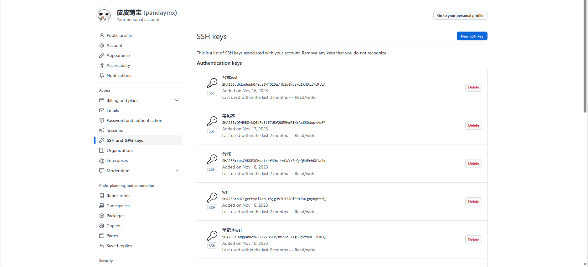
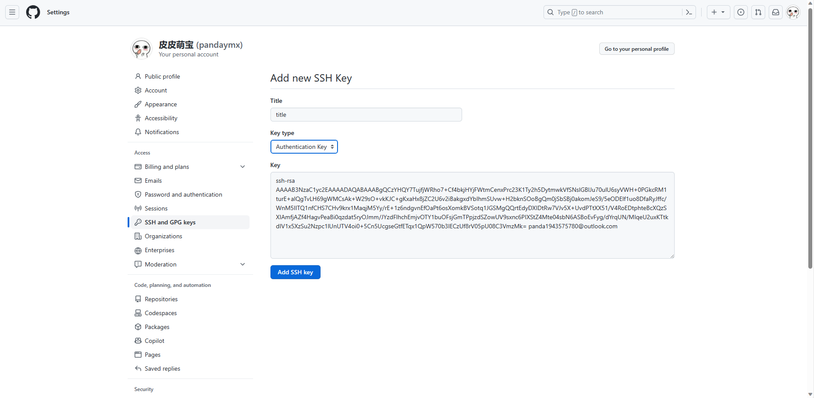

## 简介

Git 是一种分布式版本控制系统。

:::tip 是否要学习 SVN
我的建议是不要学了，因为 Git 基本已经占据了绝大部分的市场，GitHub 也声明将会放弃 SVN 的市场， 如果你的公司一定要用，那就后期再学。
:::

## 安装

### Windows的安装

下载 Git。 Git 的[官方网站](https://git-scm.com/downloads)。

安装 Git。双击下载的 .exe 文件。一路下一步即可，无需其他配置。

:::tip 不配置的原因
后期可以通过 `git config` 来进行配置，因此无需担心有问题。
:::

### Linux安装

Linux一般的发行版会自带有，如果没有可运行 `sudo apt install git` 正常安装即可。

[官网详细安装方式](https://git-scm.com/download/linux)

## 配置   

在命令行中输入这两行代码即可，对本地仓库所有用户和邮件信息进行配置。

```sh
git config --global user.name "test"
git config --global user.email test@test.com
```

之后通过 `git config --global -l` 来查看配置是否成功。

[更多配置](https://git-scm.com/docs/git-config)

## 工作流程


## 创建仓库

### 初始化仓库

Git 通过 `git init` 命令对当前目录进行初始化。

初始化之后目录会出现 **.git** 的隐藏目录。

### clone 仓库

也可以通过 `git clone` 命令来创建已有的仓库。

```sh
git clone <本地仓库地址>
git clone <远程仓库url>
```

:::tip 克隆和复制的区别
`clone` 可以获得 Git 的全部信息，包括标签、历史记录以及其它信息，因此建议使用 `git clone`。
:::

### git add

通过 `git add` 命令让 git 对文件进行跟踪，允许使用通配符。

该命令将文件添加到暂存区。

```sh
git add *
git add README.md
```

### git commit

通过 `git commit` 命令进行提交，将暂存区的文件提交到仓库中。

```sh
git commit -m '提示信息'
```

## 远程步骤

### 连接GitHub

通过 `ssh-keygen` 命令来生成 **ssh key**。

```sh
ssh-keygen -t rsa -C "your_email@youremail.com"
```

一路回车即可，如果使用过会要求你覆盖。

:::tip ssh
ssh 是一种加密登录，使用这种登录方式则不需要每次使用账号和密码进行登录。
:::

Windows 打开 `C:\Users\用户名\.ssh\id_rsa.pub` 文件，Linux 中打开 `~/.ssh/id_rsa.pub` 复制其中的内容。




点击 `New SSH key` 按钮，设置 `title` 将复制的 `key` 粘贴上去并点击 `Add SSH key` 按钮即可。


### 克隆远程库

在 GitHub 中创建一个远程库，随后通过命令和本地仓库进行绑定即可。


### 克隆仓库

找到已经上传的远程仓库，通过 `git clone` 命令对仓库进行下载。

### 推送

### 更新和合并

## 分支操作

## Github pages


<Share colorful />