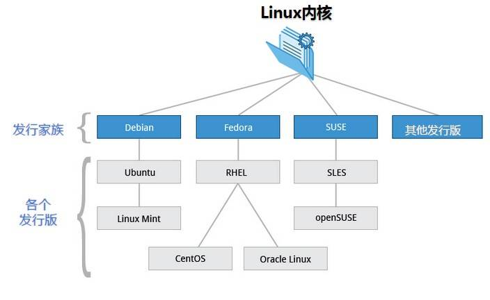
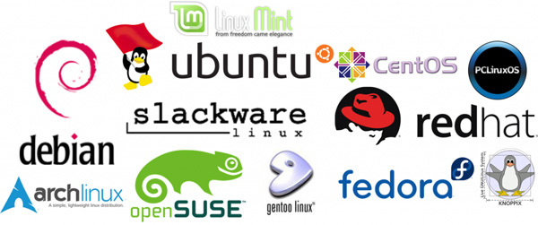

## 简介

Linux 是一种类 UNIX 操作系统，英文解释为Linux is not Unix。

### Linux的组成

1. Linux系统内核：提供最核心的功能。
2. 系统级应用程序：出厂自带程序。

### Linux发行版

Linux发行版是将Linux内核和应用软件的打包。

常见的发行版有：

### 应用程序

除个人计算机外，嵌入式到超级计算机以及服务器一般都是Linux系统。

服务器一般采用LAMP（Linux+Apache+MySQL+PHP）或（Linux+Nginx+MySQL+PHP）组合。

## Linux安装

### 虚拟机安装

### WSL安装

可以参考[wsl](../wsl.md)。Windows中使用Linux命令，可以采用wsl方式，也可以采用git bash的方式。

<Share colorful />