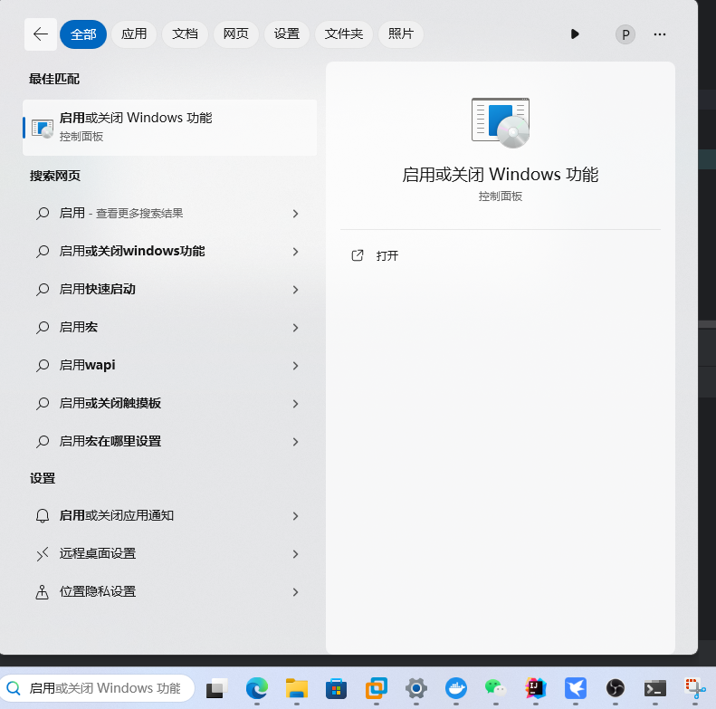
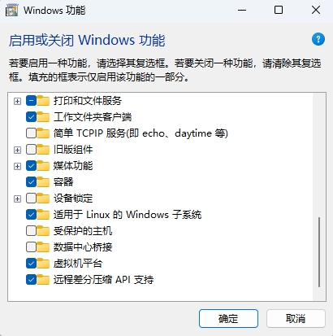
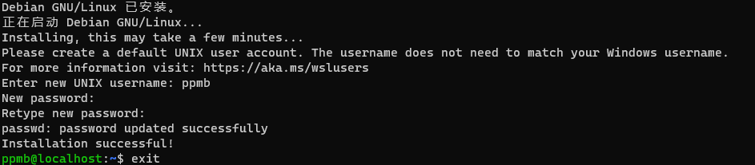
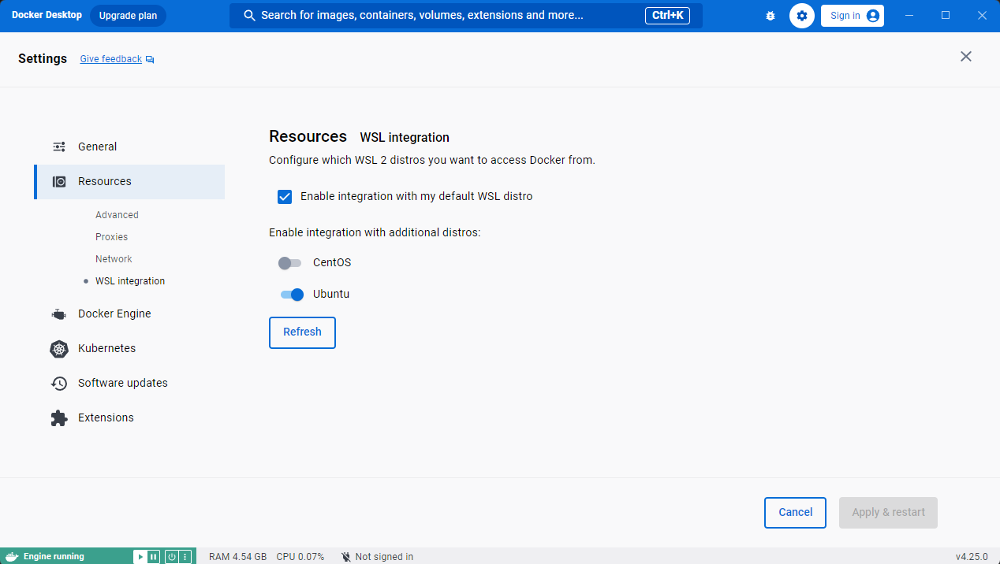

## 简介

Windows Subsystem for Linux (WSL) 是 Windows 10 新增的功能，可在 Windows 系统下运行 Linux 子系统。

WSL 与虚拟机相比，性能更高，没有更大的花销。

WSL 2 是新版本也是默认版本，相比较于 WSL 1， WSL 2 更快，但是跨文件系统性能不如前者。WSL 2在Windows 11 或Windows 10 版本1903、内部版本 18362 或更高版本中可用。

## 安装

### 新版本

以管理员权限打开命令提示符或者 PowerShell，输入以下命令：

```shell
wsl --install
```

该命令安装默认的 Linux 发行版 Ubuntu。

::: tip

该命令需要科学上网环境，也可以通过修改 hosts 文件绕过。

:::

### 旧版本


#### 启用功能

使用win+x键打开终端管理员界面，运行以下命令。

```shell
dism.exe /online /enable-feature /featurename:Microsoft-Windows-Subsystem-Linux /all /norestart
dism.exe /online /enable-feature /featurename:VirtualMachinePlatform /all /norestart
```

也可通过下方搜索栏中搜索启用或关闭Windows功能。



打开后选择适用于Windows的Linux子系统功能和虚拟机平台功能。



等待安装之后重启即可。

#### 安装内核更新包

[安装路径](https://wslstorestorage.blob.core.windows.net/wslblob/wsl_update_x64.msi)，下载之后进行安装，否则会报错。

#### 设置

```shell
wsl --set-default-version 2
```

设置成wsl 2版本。

#### 安装Linux发行版


首次启动新安装的 Linux 分发版时，将打开一个控制台窗口。之后启动时间会变快。

为防止出现问题，建议使用 `wsl --update`。

### 设置用户名密码



之后每次进入会使用这个默认的用户。

## 基本命令

### 安装

```shell
wsl --install
```

```shell
wsl --install Debian
```

该命令用于安装其他的 Linux 发行版。如果是旧版安装方式，需要使用 `wsl --install -d Debian`，也可以运行升级命令从而使用 `wsl --install Debian`。

### 列出可用的 Linux 发行版

```shell
wsl -l -o
```

微软商店中可用的 Linux 发行版。

### 列出已安装的 Linux 发行版

```shell
wsl -l --v
```

### 设置默认 Linux 发行版

```shell
wsl --set-default <Distribution Name>
```

### 将目录更改为主页

```shell
wsl ~
```

可以在用户主目录来启动。

### 运行特定 Linux 发行版

```shell
wsl -d <Distribution Name> -u <User Name>
```

如果使用默认的 Linux 发行版，去掉前面的 `-d <Distribution Name>` 。

### 更新 wsl

```shell
wsl --update
```

### 更改发行版的默认用户

```shell
<DistributionName> config --default-user <Username>
```

### 卸载发行版

```shell
wsl --unregister <Distribution Name>
```

## 最佳实践

### VS Code

- 安装 [VS Code](https://code.visualstudio.com/)。
- 添加到 path 环境变量中。
- 安装[远程开发扩展包](https://marketplace.visualstudio.com/items?itemName=ms-vscode-remote.vscode-remote-extensionpack)。

```bash
sudo apt-get update
sudo apt-get install wget ca-certificates
```

从wsl中输入 `code .`即可打开。

从 VS Code 中打开 wsl 需要使用 `ctrl+shift+p` 调出命令窗口，输入 wsl 即可使用其他命令。在 VS Code 中部分扩展可能需要单独安装在 wsl 发行版上。


### node

```bash
sudo apt-get install curl
curl -o- https://raw.githubusercontent.com/nvm-sh/nvm/master/install.sh | bash
exit
wsl
nvm install --lts
```

选择安装的是一个长期支持版本，如果要安装最新版本，可换成 `nvm install node`。

### git

使用该命令即可

```bash
sudo apt-get install git
```

需要安装 **Windows for git**。

Git 凭据管理器。

::: code-tabs#shell

@tab git版本大于2.39.0

```bash
git config --global credential.helper "/mnt/c/Program\ Files/Git/mingw64/bin/git-credential-manager.exe"
```

@tab git版本大于2.36.1

```bash
git config --global credential.helper "/mnt/c/Program\ Files/Git/mingw64/libexec/git-core/git-credential-manager.exe"
```

@tab:active git版本小于2.36.1

```bash
git config --global credential.helper "/mnt/c/Program\ Files/Git/mingw64/bin/git-credential-manager-core.exe"
```

:::

### Docker

1. 安装 [Docker Desktop](https://www.docker.com/products/docker-desktop/) 。
2. settings > Resources > WSL integration 选中需要的 Linux 发行版。（你要确保你已经打开了 WSL 引擎，一般安装前就会显示）。
    

即可在 wsl中使用 docker。

### Google Chrome

```sh
cd /tmp
wget https://dl.google.com/linux/direct/google-chrome-stable_current_amd64.deb
sudo dpkg -i google-chrome-stable_current_amd64.deb
sudo apt install --fix-broken -y
sudo dpkg -i google-chrome-stable_current_amd64.deb
sudo apt-get install fonts-wqy-microhei ttf-wqy-zenhei language-pack-zh-hans language-pack-gnome-zh-hans language-pack-kde-zh-hans manpages-zh
```

使用 `google-chrome` 即可打开谷歌浏览器，最后一步用于添加中文支持。

## 进阶

### 跨文件系统操作

Windows 中使用 wsl 命令则直接使用 `wsl 命令` 即可，例如 `wsl ls`。

wsl 中使用 Windows 命令使用 `命令.exe` 即可，例如 `ping.exe`。

### 网络

Windows 访问 wsl 系统直接使用localhost即可直接访问。

wsl 访问 Windows `cat /etc/resolv.conf` 查看 `nameserver` 获得其 IP 地址。

局域网访问使用 `netsh interface portproxy add v4tov4 listenport=8080 listenaddress=0.0.0.0 connectport=8080 connectaddress=localhost` 来实现代理，8080是端口。

:::  warning
配置这点是有缺点的，localhost:端口号不能使用。
:::

### 导入Linux发行版

从 Docker 中导出 Linux 的 tar 文件。

```bash
sudo service docker start
docker run -t centos bash ls /
dockerContainerID=$(docker container ls -a | grep -i centos | awk '{print $1}')
docker export $dockerContainerID > /mnt/c/temp/centos.tar
```

导入并运行：

```shell
cd C:\temp
mkdir E:\wslDistroStorage\CentOS
wsl --import CentOS E:\wslDistroStorage\CentOS .\centos.tar
wsl -d CentOS
```


<Share colorful />