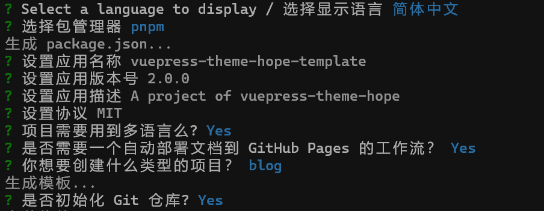

## 快速入门

### 运行环境

1. [VS Code](technology/vscode/intro.md/#安装)
2. [node.js]
3. pnpm

:::tip 提示
官方建议使用 pnpm ，yarn 也支持，但不推荐。
:::

### 创建项目

选择一个纯英文路径，不能是根目录下打开 `cmd` 。

::: code-tabs

@tab pnpm

```bash
pnpm create vuepress-theme-hope [dir]
```

@tab yarn

```bash
yarn create vuepress-theme-hope [dir]
```

@tab:active npm

```bash
npm init vuepress-theme-hope [dir]
```
:::

`[dir]` 表示的是一个参数，需要使用文件夹名代替。

选择参数如下图所示，可以根据自己的需要进行选择，建议除了应用名称或者应用描述之外不要进行修改。




### 项目内容


